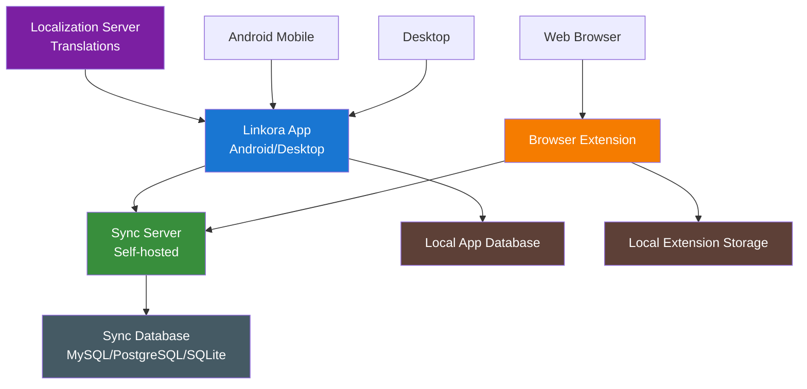

# Linkora

Linkora lets you save and organise links across your devices.

## The pieces

**[Linkora App](https://github.com/LinkoraApp/Linkora)** - The main app for Android and desktop. Save links, organise them into folders, and search through them. Works offline, syncs when connected.

**[Sync Server](https://github.com/LinkoraApp/sync-server)** - A server you run on your computer or VPS. Keeps everything in sync between devices.

**[Browser Extension](https://github.com/LinkoraApp/browser-extension)** - Save link metadata to your Linkora folders from your browser. Create folders and subfolders, and choose where to save each link.

**[Localization Server](https://github.com/LinkoraApp/localization-server)** - Serves up translations for the app. Contributors maintain translations in different languages, and the app is updated with new text without requiring a new version. You can contribute too - check the [localization server readme](https://github.com/LinkoraApp/localization-server) to see how.

## Overview

