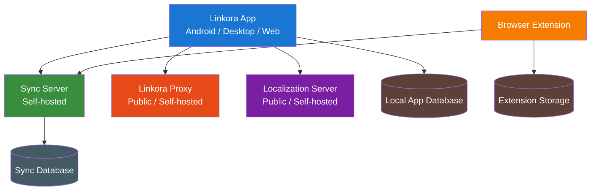

# Linkora

A local-first, self-hostable ecosystem to save, organize, and sync your links across your devices.

## Repositories

| Component | Description |
| :--- | :--- |
| **[Linkora App](https://github.com/LinkoraApp/Linkora)** | Local-first link organizer built with Kotlin Multiplatform (KMP) for Android, Desktop, and Web. Works offline and uses optional self-hosted sync. |
| **[Sync Server](https://github.com/LinkoraApp/sync-server)** | A self-hostable sync server for Linkora with browser extension support. Keeps your data in sync across all clients. |
| **[Proxy](https://github.com/LinkoraApp/proxy)** | A lightweight metadata scraper and image CORS proxy. Built to bypass strict browser restrictions for the web app. A public instance is available, or you can self-host it. |
| **[Browser Extension](https://github.com/LinkoraApp/browser-extension)** | Browser extension for saving web links to Linkora via your sync server. Integrates with your browser to save and sync web page links with metadata. |
| **[Localization Server](https://github.com/LinkoraApp/localization-server)** | Powers Linkora's remote strings, allowing translations to be updated without requiring an app update. A public instance is available, or you can self-host it. |

## Overview

```mermaid
graph TB
    A[Linkora App<br/>Android / Desktop / Web] --> B[Sync Server<br/>Self-hosted]
    C[Browser Extension] --> B
    
    A --> P[Linkora Proxy<br/>Public / Self-hosted]
    A --> D[Localization Server<br/>Public / Self-hosted]
    
    B --> E[(Sync Database)]
    A --> F[(Local App Database)]
    C --> G[(Extension Storage)]
    
    style A fill:#1976D2,color:#FFFFFF
    style B fill:#388E3C,color:#FFFFFF
    style C fill:#F57C00,color:#FFFFFF
    style P fill:#E64A19,color:#FFFFFF
    style D fill:#7B1FA2,color:#FFFFFF
    style E fill:#455A64,color:#FFFFFF
    style F fill:#5D4037,color:#FFFFFF
    style G fill:#5D4037,color:#FFFFFF
```
---

The Linkora icon used across all platforms and the web was painted by mondstern. Check out more of his paintings and related work on [Pixelfed](https://pixelfed.social/mondstern).
